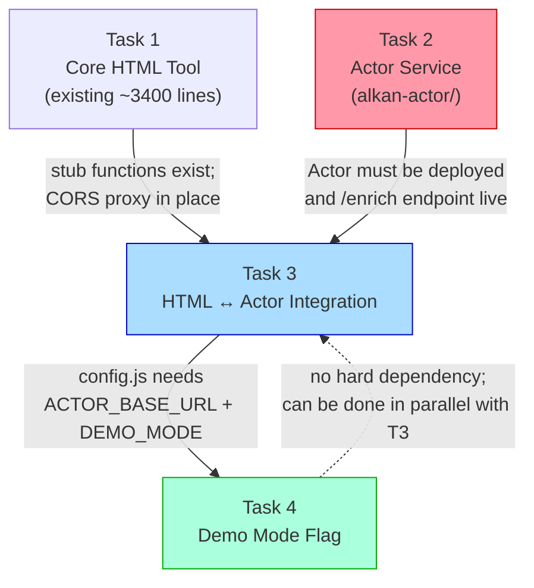

# Alkan Lead Hunter v11-EB — Architecture: Tasks 2, 3, and 4

---

## 0. Jurisdiction Portal Reference (Research-Confirmed)

| Jurisdiction | Portal URL | Portal Type | Login Required for Attachments? |
|---|---|---|---|
| **Seattle** | `https://cosaccela.seattle.gov/` | Accela ACA | No |
| **King County** | `https://aca-prod.accela.com/kingco/Default.aspx` | Accela ACA | No |
| **Tacoma** | `https://aca-prod.accela.com/tacoma/Default.aspx` | Accela ACA | No |
| **Pierce County** ⭐ | `https://pals.piercecountywa.gov/palsonline/#/permitSearch` | PALS+ (custom SPA, hash-routed) | TBD |
| **Snohomish County** | `https://pdspermitportal.snoco.org/pdsportal/app/landing` | PDS Permit Portal (custom `snoco.org`) | TBD |
| **Bellevue** | `https://permitsearch.mybuildingpermit.com/` | MyBuildingPermit.com | No (read-only search) |

> **Critical finding:** Pierce County uses **PALS+** (NOT Accela ACA). It's a React/Angular SPA with `#/` hash routing on `pals.piercecountywa.gov`. Navigation strategy differs significantly from Accela portals. Snohomish County also has a custom portal — NOT MyBuildingPermit.com.

---

## Task 2: Accela Scraping Actor — Architecture

### 2.1 Project Structure

```
alkan-actor/
├── package.json                  # Node 20+, Playwright, pdf-parse, tesseract.js, fastify
├── src/
│   ├── index.js                  # Entry: Apify Actor entrypoint OR Express/Fastify server
│   ├── server.js                 # Fastify server (standalone mode)
│   ├── actor.js                  # Apify Actor wrapper (apify-actor mode)
│   │
│   ├── jurisdictions/
│   │   ├── base-scraper.js       # Abstract base class: navigation helpers, retry logic
│   │   ├── accela-scraper.js     # Accela ACA scraper (Seattle, King County, Tacoma)
│   │   ├── pierce-scraper.js     # PALS+ scraper (pals.piercecountywa.gov)
│   │   ├── snohomish-scraper.js  # PDS Portal scraper (pdspermitportal.snoco.org)
│   │   └── registry.js           # Maps jurisdiction → scraper class
│   │
│   ├── pdf/
│   │   ├── extractor.js          # Orchestrates native extraction → OCR fallback
│   │   ├── native-extract.js     # pdf-parse native text extraction
│   │   ├── ocr-extract.js        # Tesseract.js OCR fallback for scanned PDFs
│   │   └── field-parser.js       # Regex patterns → structured fields
│   │
│   ├── browser/
│   │   ├── session-manager.js    # Reuses browser context across requests
│   │   └── download-helper.js    # Intercepts Playwright downloads
│   │
│   └── utils/
│       ├── logger.js             # Pino logger, PII scrubbing, log level via LOG_LEVEL env
│       ├── rate-limiter.js       # Configurable delays + exponential backoff
│       └── errors.js             # Typed error classes
│
├── tests/
│   ├── fixtures/                 # Sample PDFs, HTML snapshots for unit tests
│   ├── pdf.test.js               # Tests for field-parser.js regex patterns
│   ├── accela.test.js            # Playwright test against cosaccela.seattle.gov (live)
│   └── server.test.js            # Fastify API contract tests
│
├── .env.example                  # LOG_LEVEL, PORT, REQUEST_DELAY_MS, API_KEY
└── apify_storage/                # Apify local emulation (gitignored)
```

---

### 2.2 Accela Navigation — ASCII Flow Diagram

```
┌─────────────────────────────────────────────────────────────────────────┐
│                    ACCELA ACA — Permit Lookup Flow                      │
│            (Seattle / King County / Tacoma — same engine)               │
└─────────────────────────────────────────────────────────────────────────┘

  INPUT: { permit_number: "6802437-CN", jurisdiction: "seattle" }
          │
          ▼
  ┌─────────────────────────────────┐
  │  1. GET <base_url>/Default.aspx │  ← Session reuse: skip if context warm
  │     page.goto(baseUrl)          │
  │     Wait for #ctl00_Header      │
  └──────────────┬──────────────────┘
                 │
                 ▼
  ┌─────────────────────────────────────────────────────┐
  │  2. Navigate to Record Search                       │
  │     page.click('a[href*="GeneralSearch"]')          │
  │     OR direct: goto(`${baseUrl}/GeneralSearch/...`) │
  │     Wait for search form: #ctl00_PlaceHolderMain... │
  └──────────────┬──────────────────────────────────────┘
                 │
                 ▼
  ┌─────────────────────────────────────────────────────┐
  │  3. Enter permit number                             │
  │     page.fill('#ctl00_...txtPermitNumber', permit#) │
  │     page.click('#ctl00_...btnSearch')               │
  │     ← ASP.NET postback: wait for form re-render     │
  │     waitForNavigation({ waitUntil: 'networkidle' }) │
  └──────────────┬──────────────────────────────────────┘
                 │
                 ├── No results row? → return { success: false, error: "not_found" }
                 │
                 ▼
  ┌─────────────────────────────────────────────────────┐
  │  4. Click permit number link in results             │
  │     page.click('td.PermitNumberColumnLink a')       │
  │     waitForNavigation({ waitUntil: 'networkidle' }) │
  │     ← Lands on permit detail page                   │
  └──────────────┬──────────────────────────────────────┘
                 │
                 ▼
  ┌─────────────────────────────────────────────────────┐
  │  5. Locate "Attachments" tab                        │
  │     page.locator('a:has-text("Attachments")')       │
  │     ← Tab may be hidden; scroll into view if needed │
  │     tab visible? ─── No ──→ return no_attachments   │
  │            │                                        │
  │           Yes                                       │
  └──────────────┬──────────────────────────────────────┘
                 │
                 ▼
  ┌─────────────────────────────────────────────────────┐
  │  6. Click Attachments tab                           │
  │     page.click('a:has-text("Attachments")')         │
  │     ← Another ASP.NET postback (__VIEWSTATE reload) │
  │     waitForSelector('.AttachmentList, table.rows')  │
  └──────────────┬──────────────────────────────────────┘
                 │
                 ├── 0 attachments? → return no_documents
                 │
                 ▼
  ┌─────────────────────────────────────────────────────┐
  │  7. Filter for "Application" type PDF               │
  │     Scan attachment list for "Application" or       │
  │     "Permit Application Form" in Type/Name column   │
  │     Take first match; fallback to any PDF           │
  └──────────────┬──────────────────────────────────────┘
                 │
                 ▼
  ┌─────────────────────────────────────────────────────┐
  │  8. Download PDF                                    │
  │     const [download] = await Promise.all([          │
  │       page.waitForEvent('download'),                │
  │       page.click('a.attachmentLink')                │
  │     ])                                              │
  │     const path = await download.path()              │
  └──────────────┬──────────────────────────────────────┘
                 │
                 ▼
  ┌─────────────────────────────────────────────────────┐
  │  9. PDF Extraction Pipeline (see §2.4)              │
  └──────────────┬──────────────────────────────────────┘
                 │
                 ▼
  ┌─────────────────────────────────────────────────────┐
  │ 10. Return JSON                                     │
  │  { success: true, data: { owner_name, owner_phone,  │
  │    owner_email, architect_name, owners_rep } }      │
  └─────────────────────────────────────────────────────┘
```

---

### 2.3 Jurisdiction-Specific Navigation Variants

#### Seattle (`cosaccela.seattle.gov`) — Accela ACA Standard
- Base URL: `https://cosaccela.seattle.gov/`
- Search path: `Default.aspx` → General Search form → record detail → Attachments tab
- No login required for attachments

#### King County (`aca-prod.accela.com/kingco`) — Accela ACA Standard
- Base URL: `https://aca-prod.accela.com/kingco/`
- Module path: `Cap/CapHome.aspx?module=Building&TabName=Building`
- Same Attachments tab flow as Seattle

#### Tacoma (`aca-prod.accela.com/tacoma`) — Accela ACA Standard
- Base URL: `https://aca-prod.accela.com/tacoma/`
- Same flow as King County
- Historical pre-Accela permits: `govme.org/govME/Permits/...` — out of scope for v1

#### Pierce County (`pals.piercecountywa.gov`) ⭐ HIGHEST PRIORITY — Custom SPA
```
  INPUT: { permit_number: "...", jurisdiction: "pierce_county" }
          │
          ▼
  ┌─────────────────────────────────────────────────────┐
  │  1. goto https://pals.piercecountywa.gov/           │
  │     palsonline/#/permitSearch                       │
  │     Wait for Angular/React SPA bootstrap            │
  │     waitForSelector('[class*="search"], input')     │
  └──────────────┬──────────────────────────────────────┘
                 │
                 ▼
  ┌─────────────────────────────────────────────────────┐
  │  2. Fill permit number search field                 │
  │     Locate input[placeholder*="permit" i]           │
  │     OR input[type="search"] — inspect live          │
  │     page.fill(selector, permit_number)              │
  │     page.keyboard.press('Enter') or click Search    │
  └──────────────┬──────────────────────────────────────┘
                 │
                 ▼
  ┌─────────────────────────────────────────────────────┐
  │  3. Click result row → permit detail                │
  │     Wait for detail panel / route change: /#/permit │
  │     waitForURL('**/permit/**')                      │
  └──────────────┬──────────────────────────────────────┘
                 │
                 ▼
  ┌─────────────────────────────────────────────────────┐
  │  4. Locate Documents/Attachments tab                │
  │     Try: a:has-text("Documents"),                   │
  │           a:has-text("Attachments"),                │
  │           [role="tab"]:has-text("Files")            │
  │     (Exact tab name unknown — must verify live)     │
  └──────────────┬──────────────────────────────────────┘
                 │
                 ▼
  ┌─────────────────────────────────────────────────────┐
  │  5. Download PDF (same as Accela step 8)            │
  └─────────────────────────────────────────────────────┘
```
> **NOTE:** PALS+ uses hash routing (`#/`). Use `page.waitForFunction(() => location.hash.includes('/permit/'))` for navigation detection rather than `waitForNavigation`. Selector names must be verified against the live portal before implementation.

#### Snohomish County (`pdspermitportal.snoco.org`) — Custom Portal
```
  Primary search: https://pdspermitportal.snoco.org/pdsportal/app/landing
  Fallback/legacy: https://www.snoco.org/v1/PDS/permitstatus/disclaimer.aspx
```
- Strategy: Attempt new PDS portal first; fall back to legacy status search
- Navigation: Standard SPA pattern; inspect live for exact selectors
- Documents tab: unknown — requires live inspection

---

### 2.4 PDF Extraction Pipeline

```
  Downloaded PDF (tmp file)
          │
          ▼
  ┌─────────────────────────────────────────────────────┐
  │  STAGE 1: Native Text Extraction (pdf-parse)        │
  │  const { text } = await pdfParse(buffer)            │
  │  textLength = text.trim().length                    │
  │  textDensity = textLength / pageCount               │
  └──────────┬──────────────────────────────────────────┘
             │
             ├── textDensity > 200 chars/page → proceed
             │
             ├── textDensity ≤ 200 chars/page (scanned)
             │        │
             │        ▼
             │  ┌─────────────────────────────────────────┐
             │  │  STAGE 2: OCR Fallback (Tesseract.js)   │
             │  │  Convert PDF pages → image (pdf-to-img  │
             │  │  or pdfjs-dist render → canvas)         │
             │  │  tesseract.recognize(imageBuffer,       │
             │  │    'eng', { logger: silentLogger })      │
             │  │  text = ocrResult.data.text             │
             │  └──────────────┬──────────────────────────┘
             │                 │
             └────────────────┐│
                              ││
                              ▼▼
  ┌─────────────────────────────────────────────────────┐
  │  STAGE 3: Field Parsing (field-parser.js)           │
  │                                                     │
  │  OWNER NAME patterns:                               │
  │    /owner['\s]*name[:\s]+([^\n]+)/i                 │
  │    /applicant[:\s]+([^\n]+)/i                       │
  │    /property\s+owner[:\s]+([^\n]+)/i                │
  │                                                     │
  │  OWNER PHONE patterns:                              │
  │    /(?:phone|tel|ph)[:\s]+(\(?\d{3}\)?[\s.-]\d{3}…)/i │
  │    /(\(?\d{3}\)?[\s.-]\d{3}[\s.-]\d{4})/           │
  │                                                     │
  │  OWNER EMAIL patterns:                              │
  │    /([a-zA-Z0-9._%+-]+@[a-zA-Z0-9.-]+\.[a-z]{2,})/ │
  │    (first email near "owner" context wins)          │
  │                                                     │
  │  ARCHITECT patterns:                                │
  │    /architect[:\s]+([^\n]+)/i                       │
  │    /designer[:\s]+([^\n]+)/i                        │
  │                                                     │
  │  OWNER'S REP patterns:                              │
  │    /owner['\s]*s?\s+rep(?:resentative)?[:\s]+([^\n]+)/i │
  │    /agent[:\s]+([^\n]+)/i                           │
  │    /contact[:\s]+([^\n]+)/i                         │
  └──────────────┬──────────────────────────────────────┘
                 │
                 ▼
  ┌─────────────────────────────────────────────────────┐
  │  STAGE 4: Confidence Scoring                        │
  │  Each field gets confidence: 'high' | 'low' | null  │
  │  'high': matched named-label pattern                 │
  │  'low': matched generic pattern (e.g. bare phone)   │
  │  null: field not found                              │
  └──────────────┬──────────────────────────────────────┘
                 │
                 ▼
  { owner_name, owner_phone, owner_email,
    architect_name, owners_rep, _confidence }
```

---

### 2.5 Playwright Pseudocode — ASP.NET WebForms Navigation

```javascript
// accela-scraper.js — key navigation logic (pseudocode)

async function scrapeAccelaPermit(permitNumber, baseUrl, browserContext) {
  const page = await browserContext.newPage();

  // Rate limiter: wait configured delay before each request
  await rateLimiter.wait();

  // 1. Load portal home
  await page.goto(`${baseUrl}/Default.aspx`, { waitUntil: 'networkidle' });

  // 2. Navigate to General Search
  // Direct URL navigation is more reliable than clicking nav links on WebForms
  await page.goto(
    `${baseUrl}/GeneralSearch/GeneralSearchEntry.aspx?isPortlet=N`,
    { waitUntil: 'networkidle' }
  );

  // 3. Fill and submit search form
  // Selector IDs are Accela-standard but may include a GUID suffix — inspect live
  await page.fill('input[id$="txtPermitNumber"]', permitNumber);
  await Promise.all([
    page.waitForNavigation({ waitUntil: 'networkidle' }),
    page.click('input[id$="btnSearch"]')
  ]);

  // 4. Check for results
  const resultRow = page.locator('td.PermitNumberColumnLink a').first();
  if (!(await resultRow.isVisible())) {
    return { success: false, error: 'permit_not_found' };
  }

  // 5. Click permit link → detail page (ASP.NET postback)
  await Promise.all([
    page.waitForNavigation({ waitUntil: 'networkidle' }),
    resultRow.click()
  ]);

  // 6. Attachments tab — check visibility first
  const attachTab = page.locator('a:has-text("Attachments")');
  if (!(await attachTab.isVisible())) {
    return { success: false, error: 'no_attachments_tab' };
  }

  // 7. Click Attachments tab (triggers __VIEWSTATE postback)
  await Promise.all([
    page.waitForResponse(r => r.url().includes('Default.aspx')),
    attachTab.click()
  ]);
  await page.waitForLoadState('networkidle');

  // 8. Find application PDF link
  const rows = page.locator('tr.ACA_TabRow_Odd, tr.ACA_TabRow_Even');
  const count = await rows.count();
  if (count === 0) {
    return { success: false, error: 'no_documents' };
  }

  // Prefer "Application" type; fallback to first PDF
  let targetLink = null;
  for (let i = 0; i < count; i++) {
    const row = rows.nth(i);
    const typeText = await row.locator('td').first().textContent();
    if (/application/i.test(typeText)) {
      targetLink = row.locator('a').first();
      break;
    }
  }
  if (!targetLink) targetLink = rows.nth(0).locator('a').first();

  // 9. Download PDF via Playwright download interception
  const [download] = await Promise.all([
    page.waitForEvent('download'),
    targetLink.click()
  ]);
  const localPath = await download.path();
  await page.close();

  // 10. Extract fields from PDF
  return pdfExtractor.extract(localPath);
}
```

---

### 2.6 Apify Actor Interface Definition

```json
// INPUT SCHEMA (apify_storage/key_value_stores/default/INPUT.json)
{
  "permit_number": {
    "type": "string",
    "description": "Permit/record number to look up",
    "editor": "textfield"
  },
  "jurisdiction": {
    "type": "string",
    "description": "Target jurisdiction",
    "enum": ["seattle", "bellevue", "tacoma", "king_county", "pierce_county", "snohomish"],
    "editor": "select"
  },
  "batch": {
    "type": "array",
    "description": "Optional: array of {permit_number, jurisdiction} for batch mode",
    "editor": "json"
  }
}

// OUTPUT SCHEMA (dataset record)
{
  "permit_number": "string",
  "jurisdiction": "string",
  "success": "boolean",
  "data": {
    "owner_name": "string | null",
    "owner_phone": "string | null",
    "owner_email": "string | null",
    "architect_name": "string | null",
    "owners_rep": "string | null",
    "_confidence": { "owner_name": "high|low|null", "..." }
  },
  "error": "string | null",
  "scraped_at": "ISO8601 timestamp"
}
```

**Actor environment variables (`.env`):**
```
LOG_LEVEL=info          # 'debug' in dev; NEVER debug in prod (avoids PII logging)
REQUEST_DELAY_MS=2000   # Base delay between permit lookups
MAX_RETRIES=3           # Exponential backoff attempts
BACKOFF_BASE_MS=1000    # First retry delay; doubles each attempt
PORT=3001               # Fastify server port (standalone mode)
API_KEY=changeme        # Shared secret for HTML tool → Actor auth
```

---

### 2.7 Session & Rate Limiting Design

```
SessionManager:
  - One Playwright Browser instance per process (Chromium headless)
  - One BrowserContext reused across all permits in a batch
  - Context reset (newContext()) after: auth errors, 50 permits, or 1h
  - Cookies and localStorage kept warm across lookups

RateLimiter:
  - Base delay: REQUEST_DELAY_MS (default 2000ms) between each permit
  - On 429/5xx: exponential backoff — delay = BACKOFF_BASE_MS * 2^retryN
  - Max retries: MAX_RETRIES (default 3)
  - Jitter: ±20% randomization on each delay to avoid detectable patterns
```

---

## Task 3: Integration Architecture

### 3.1 API Contract (Actor exposes as Fastify HTTP server)

#### `POST /enrich`
Enrich a single permit with contact data.

**Request:**
```json
{
  "permit_number": "6802437-CN",
  "jurisdiction": "seattle"
}
```
**Headers:** `x-api-key: <API_KEY>`

**Response 200:**
```json
{
  "success": true,
  "permit_number": "6802437-CN",
  "jurisdiction": "seattle",
  "data": {
    "owner_name": "Jane Smith",
    "owner_phone": "206-555-1234",
    "owner_email": "jane@example.com",
    "architect_name": "ABC Design Studio",
    "owners_rep": null
  },
  "scraped_at": "2026-05-23T12:00:00Z"
}
```

**Response 200 (not found / error):**
```json
{
  "success": false,
  "permit_number": "6802437-CN",
  "jurisdiction": "seattle",
  "error": "permit_not_found | no_attachments_tab | no_documents | scrape_failed | pdf_parse_failed",
  "scraped_at": "2026-05-23T12:00:00Z"
}
```

**Response 401:** Missing or invalid `x-api-key`
**Response 429:** Rate limit — include `Retry-After` header

---

#### `POST /enrich/batch`
Enrich multiple permits sequentially (for Bulk Enrich Top 20 button).

**Request:**
```json
{
  "leads": [
    { "permit_number": "6802437-CN", "jurisdiction": "seattle" },
    { "permit_number": "22-0042345", "jurisdiction": "pierce_county" }
  ]
}
```
**Response 200:** Array of individual enrich results (same schema as `/enrich`).
The Actor processes them sequentially with rate limiting applied internally.

---

#### `GET /health`
**Response 200:** `{ "status": "ok", "version": "1.0.0" }`
No auth required. Used for liveness checks from the HTML tool.

---

### 3.2 HTML Tool Client-Side Changes

#### `config.example.js` — New fields
```javascript
window.ALKAN_CONFIG = {
  // ... existing fields ...

  // ── Actor / Enrichment backend ─────────────────────────────────────────────
  ACTOR_BASE_URL: "http://localhost:3001",   // or deployed URL
  ACTOR_API_KEY:  "changeme",

  // ── Demo mode ──────────────────────────────────────────────────────────────
  DEMO_MODE: false
};
```

#### Affected HTML sections / JS functions

| Current Code | Change Required |
|---|---|
| `scrapeKingCounty()` | Replace stub body with `actorEnrich(permit_number, 'king_county')` |
| `scrapePierceCounty()` | Replace stub body with `actorEnrich(permit_number, 'pierce_county')` |
| `scrapeSnohomish()` | Replace stub body with `actorEnrich(permit_number, 'snohomish')` |
| CORS proxy calls (`corsproxy.io`, etc.) | All proxied requests route through Actor `/proxy` endpoint |
| Lead card rendering | Add enrichment status badge: `pending` / `enriched` / `failed` |
| "Bulk Enrich Top 20" button handler | Replace loop with `POST /enrich/batch` |

---

### 3.3 New Client-Side Module: `actor-client.js`

A small module (~100 lines) to be `<script>`-included in the HTML tool:

```
Functions:
  actorEnrich(permit_number, jurisdiction)       → calls POST /enrich
  actorEnrichBatch(leads[])                      → calls POST /enrich/batch
  actorHealth()                                  → calls GET /health

State tracking per lead (in-memory + localStorage):
  enrichment_status: 'idle' | 'pending' | 'success' | 'failed'
  enrichment_data: { owner_name, owner_phone, ... } | null
  enrichment_error: string | null
  enriched_at: ISO8601 | null

Retry logic:
  On 429: wait Retry-After header value, then retry once
  On 5xx: single retry after 3s
  On network error: mark failed immediately
```

---

### 3.4 Visual Feedback — Enrichment Status Per Lead

Each lead card in the HTML tool gets a status indicator:

```
┌─────────────────────────────────────────────────────┐
│  6802437-CN  |  New Construction  |  $485,000        │
│  123 Main St, Seattle, WA  98101                    │
│                                                     │
│  ● Owner: Jane Smith  |  206-555-1234               │  ← shown after success
│  ● Architect: ABC Design Studio                     │
│                                                     │
│  [Enrich ▶]  ⏳ Pending...                          │  ← status badge
│              ✅ Enriched 5/23/26                    │  ← on success
│              ❌ Failed: no_documents                 │  ← on failure
└─────────────────────────────────────────────────────┘
```

**Auto-enrich flow:** When a new lead is fetched (from Socrata/ArcGIS), if `ACTOR_BASE_URL` is configured and the lead has no enrichment data, automatically queue `actorEnrich()` in the background. Show `⏳ Pending` immediately; update card when response arrives.

---

### 3.5 Replacing CORS Proxies

The Actor adds an optional `/proxy` endpoint for passing Socrata/ArcGIS API calls server-side (eliminating dependency on `corsproxy.io` etc.):

#### `GET /proxy?url=<encoded_url>`
- **Auth:** `x-api-key` required
- **Behavior:** Server-side fetch of the target URL; forwards response body and content-type
- **Allowed origins:** Whitelist of `*.seattle.gov`, `*.kingcounty.gov`, `*.cityofbellevue.org`, `*.cityoftacoma.org` in Actor config

The three existing Socrata/ArcGIS fetch functions in the HTML tool replace their CORS proxy prefix with `${ACTOR_BASE_URL}/proxy?url=`.

---

## Task 4: Demo Mode Flag

### 4.1 Configuration

In `config.js` (and `config.example.js`):
```javascript
DEMO_MODE: false   // set to true to enable demo data features
```

### 4.2 Behavior Matrix

| Behavior | `DEMO_MODE: true` | `DEMO_MODE: false` |
|---|---|---|
| "Re-seed Demo" button | Visible | Hidden (`display:none`) |
| `seedDemoLeads()` on first load | Runs | Skipped |
| Manual re-seed button click | Allowed | Button absent |
| Demo leads in display | Shown | Hidden (filtered out) |
| `actorEnrich()` on demo leads | Skipped (no-op) | N/A |

### 4.3 Implementation Changes (HTML tool)

1. **On app init:** `if (!ALKAN_CONFIG.DEMO_MODE) { document.getElementById('btn-reseed-demo').style.display = 'none'; }`
2. **First-load seed guard:** `if (ALKAN_CONFIG.DEMO_MODE && !localStorage.getItem('demo_seeded')) { seedDemoLeads(); }`
3. **Lead fetch/display:** Add filter `leads.filter(l => ALKAN_CONFIG.DEMO_MODE || !l.id.startsWith('demo_'))`
4. **Enrich guard:** `if (lead.id.startsWith('demo_')) return;`

### 4.4 Migration — Cleaning Demo Leads from Existing Storage

#### localStorage (current storage)
```javascript
// Run once in browser console, or on app init when DEMO_MODE transitions to false
function purgeLocalStorageDemoLeads() {
  const raw = localStorage.getItem('alkan_leads');
  if (!raw) return;
  const leads = JSON.parse(raw);
  const cleaned = leads.filter(l => !l.id.startsWith('demo_'));
  localStorage.setItem('alkan_leads', JSON.stringify(cleaned));
  console.log(`Purged ${leads.length - cleaned.length} demo leads from localStorage`);
}
```

#### Supabase
```sql
-- Safe to run in Supabase SQL editor
-- Demo leads have id values starting with 'demo_'
DELETE FROM leads
WHERE id LIKE 'demo_%';
```

**Migration trigger:** On app load, if `DEMO_MODE === false`, call `purgeLocalStorageDemoLeads()` once (guarded by `localStorage.getItem('demo_purge_done')` flag).

---

## Dependency Graph



**Execution order:**
1. **Task 2** first — Actor must exist before integration is possible
2. **Task 4** in parallel with Task 2 — trivial, no dependencies
3. **Task 3** last — requires Task 2 deployed and Task 4 config fields present

---

## Risk Matrix

| Risk | Severity | Likelihood | Mitigation |
|---|---|---|---|
| **Pierce County PALS+ selectors unknown** — SPA; tab names and input selectors must be verified live | High | High | Allocate a discovery session before writing `pierce-scraper.js`; treat selectors as config constants, not hardcoded strings |
| **Snohomish Portal selectors unknown** — Custom portal; same discovery problem | Medium | High | Same mitigation; fallback to legacy `snoco.org/v1/PDS/permitstatus/` if new portal is hostile |
| **Accela login wall for attachments** — Some permit types may require authenticated session | High | Medium | Test Seattle portal anonymously first; design opt-in credential store in `.env` if login is needed |
| **Scanned PDFs with poor OCR quality** — Low-quality scans produce garbage text; owner fields may not parse | Medium | Medium | `_confidence` field signals low-quality results; UI shows "Review Required" badge instead of auto-populating |
| **Accela HTML structure changes between jurisdictions** — `ctl00_*` ID suffixes differ across Accela versions | Medium | High | Abstract selectors into per-jurisdiction config objects in `registry.js`, not hardcoded in scraper logic |
| **Playwright download blocked by Accela MIME type guard** — PDFs may open inline instead of downloading | Medium | Low | Intercept `page.route('**/*.pdf', ...)` and force `Content-Disposition: attachment` via response override |
| **Rate limiting / IP ban by portal** | High | Medium | Configurable `REQUEST_DELAY_MS`; exponential backoff; jitter; rotate proxies if needed (not in v1) |
| **CORS proxy replacement breaks existing API fetches** | Medium | Low | Introduce `/proxy` endpoint as opt-in; old proxy calls still work as fallback until migrated |
| **Demo leads mixed with real leads in Supabase** | Low | Already exists | One-time SQL `DELETE FROM leads WHERE id LIKE 'demo_%'` is safe and reversible |

---

## Summary: Files to Create / Modify

| File | Action | Task |
|---|---|---|
| `alkan-actor/package.json` | Create | T2 |
| `alkan-actor/src/jurisdictions/accela-scraper.js` | Create | T2 |
| `alkan-actor/src/jurisdictions/pierce-scraper.js` | Create | T2 |
| `alkan-actor/src/jurisdictions/snohomish-scraper.js` | Create | T2 |
| `alkan-actor/src/pdf/extractor.js` | Create | T2 |
| `alkan-actor/src/server.js` | Create | T2 |
| `config.example.js` | Edit: add `ACTOR_BASE_URL`, `ACTOR_API_KEY`, `DEMO_MODE` | T3+T4 |
| HTML tool (main `.html` file) | Edit: replace stubs, add actor-client.js script tag, add enrichment UI | T3 |
| HTML tool | Edit: DEMO_MODE guards on seed and button | T4 |
| `supabase-migration.sql` | Edit: add demo-purge SQL snippet (as comment) | T4 |
