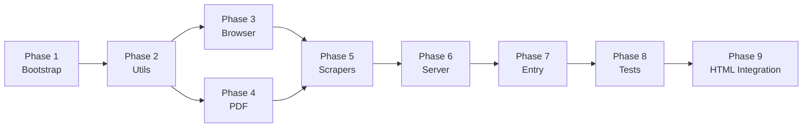

## Objective
Build the `alkan-actor` Node.js service from scratch, starting from the scaffold you've shared. All files listed below are **new creates** unless marked **edit**.

---

## Phase 1 — Project Bootstrap

### Step 1.1 — Create directory tree
```
alkan-actor/
├── src/
│   ├── jurisdictions/
│   ├── pdf/
│   ├── browser/
│   └── utils/
├── tests/
│   └── fixtures/
```

### Step 1.2 — `package.json`
Exactly as you provided, with one addition: add `"pdfjs-dist": "^4.0.0"` to convert PDF pages to images for the OCR pipeline.

```json
{
  "name": "alkan-actor",
  "version": "1.0.0",
  "description": "Backend engine for Alkan Lead Hunter",
  "main": "src/index.js",
  "type": "module",
  "dependencies": {
    "playwright": "^1.40.0",
    "fastify": "^4.25.0",
    "pdf-parse": "^1.1.1",
    "tesseract.js": "^5.0.0",
    "pdfjs-dist": "^4.0.0",
    "pino": "^8.17.0",
    "dotenv": "^16.3.1"
  },
  "scripts": {
    "start": "node src/index.js",
    "dev": "node --watch src/index.js",
    "test": "node --test tests/"
  }
}
```
> `"type": "module"` enables ES module `import/export` throughout (consistent with modern Node 20+).

### Step 1.3 — `.env` (and `.env.example` committed to repo)
```
LOG_LEVEL=info
PORT=3001
REQUEST_DELAY_MS=2000
MAX_RETRIES=3
BACKOFF_BASE_MS=1000
API_KEY=changeme
```

---

## Phase 2 — Core Utilities (`src/utils/`)

### `src/utils/logger.js`
- Wraps `pino` with `LOG_LEVEL` from env
- Exports a `scrubPII(text)` helper: redacts phone patterns and email patterns from log strings before emitting at `debug` level
- **Rule:** PII fields (`owner_name`, `owner_phone`, `owner_email`) are **never** passed to any logger call at `info` or above; only permit numbers and jurisdictions are logged in production

### `src/utils/errors.js`
Typed error classes used throughout:
```
NavigationError       — page.goto or waitForNavigation failed
PermitNotFoundError   — search returned 0 results
NoAttachmentsError    — Attachments tab absent or 0 documents
DownloadError         — Playwright download event never fired
PDFParseError         — pdf-parse threw; triggers OCR fallback
OCRError              — Tesseract also failed; field extraction impossible
RateLimitError        — upstream portal returned 429
AuthError             — 401/403 from portal (may need login)
```

### `src/utils/rate-limiter.js`
- `RateLimiter` class
- `wait()` — awaits `REQUEST_DELAY_MS` + ±20% jitter before resolving
- `backoff(attempt)` — returns `BACKOFF_BASE_MS * 2^attempt` ms, capped at 30s
- Both values read from `process.env` at construction time (not import time, so tests can override)

---

## Phase 3 — Browser Session Manager (`src/browser/`)

### `src/browser/session-manager.js`
- Singleton: one `Browser` instance, one `BrowserContext` reused
- `getContext()` — launches browser on first call; returns existing context on subsequent calls
- `resetContext()` — closes current context, creates fresh one; called after:
  - `AuthError` is thrown
  - 50 permits have been processed
  - Context age exceeds 60 minutes
- `close()` — graceful shutdown; called on `SIGTERM`/`SIGINT`

### `src/browser/download-helper.js`
- `interceptDownload(page, clickFn)` — wraps `Promise.all([page.waitForEvent('download'), clickFn()])`, returns local temp path
- If the portal opens PDF inline (new tab, `blob:` URL, or iframe), fallback strategy:
  1. Detect `page.waitForEvent('popup')` racing `waitForEvent('download')`
  2. If popup wins: get popup URL → `fetch()` it server-side using session cookies from `context.cookies()`

---

## Phase 4 — PDF Extraction Pipeline (`src/pdf/`)

### `src/pdf/native-extract.js`
- Accepts a file path buffer
- Uses `pdf-parse` to extract raw text
- Returns `{ text: string, pageCount: number, density: number }`
- `density = text.trim().length / pageCount`

### `src/pdf/ocr-extract.js`
- Called when `density < 200` chars/page (scanned PDF)
- Uses `pdfjs-dist` to render each page to an off-screen canvas (Node canvas via `canvas` npm package)
- Passes each page image buffer to `tesseract.js` `recognize()`
- Concatenates recognized text from all pages
- Logger at `debug` level only; no PII emitted

### `src/pdf/field-parser.js`
Regex patterns for each field. Each pattern set has **two tiers**:
- **Tier 1 (high confidence):** labeled match — e.g. `Owner Name: ...`
- **Tier 2 (low confidence):** generic match — e.g. bare phone number

| Field | Tier 1 pattern | Tier 2 fallback |
|---|---|---|
| `owner_name` | `/(?:owner|applicant|property\s+owner)[:\s]+([^\n]{2,60})/i` | None — too ambiguous |
| `owner_phone` | `/(?:phone|tel|ph)[:\s]+(\(?\d{3}\)?[\s.\-]\d{3}[\s.\-]\d{4})/i` | `/(\(?\d{3}\)?[\s.\-]\d{3}[\s.\-]\d{4})/` |
| `owner_email` | `/([a-zA-Z0-9._%+\-]+@[a-zA-Z0-9.\-]+\.[a-z]{2,})/` | Same (email is self-labeling) |
| `architect_name` | `/(?:architect|designer)[:\s]+([^\n]{2,60})/i` | None |
| `owners_rep` | `/(?:owner['\u2019]?s?\s+rep(?:resentative)?|agent|authorized\s+representative)[:\s]+([^\n]{2,60})/i` | None |

Returns:
```json
{
  "owner_name": "Jane Smith",
  "owner_phone": "206-555-1234",
  "owner_email": "jane@example.com",
  "architect_name": "ABC Design",
  "owners_rep": null,
  "_confidence": {
    "owner_name": "high",
    "owner_phone": "high",
    "owner_email": "high",
    "architect_name": "low",
    "owners_rep": null
  }
}
```

### `src/pdf/extractor.js`
Orchestrator:
```
extract(filePath):
  1. native-extract → if density OK → field-parser → return
  2. if density too low → ocr-extract → field-parser → return
  3. if OCR also fails → throw PDFParseError
```

---

## Phase 5 — Jurisdiction Scrapers (`src/jurisdictions/`)

### `src/jurisdictions/base-scraper.js`
Expand your scaffold with:
- `scrape(permitNumber)` — abstract; subclasses implement
- `safeNavigate(page, url)` — as you wrote
- `waitForSPA(page, hashFragment)` — waits for `page.waitForFunction(hash => location.hash.includes(hash), hashFragment)` (used by Pierce)
- `findAndDownloadPDF(page, preferredTypeKeyword)` — shared attachment-tab download logic (used by Accela scrapers); returns local temp path
- `scrubPII(data)` — delegates to `logger.scrubPII`; used before any `logger.debug()` call

### `src/jurisdictions/accela-scraper.js`
Implements Accela ACA flow for **Seattle, King County, Tacoma**.

Config object per jurisdiction (in `registry.js`, passed in at construction):
```js
{
  baseUrl: 'https://cosaccela.seattle.gov',
  searchPath: '/GeneralSearch/GeneralSearchEntry.aspx?isPortlet=N',
  permitInputSelector: 'input[id$="txtPermitNumber"]',
  searchButtonSelector: 'input[id$="btnSearch"]',
  resultLinkSelector: 'td.PermitNumberColumnLink a'
}
```
Full navigation flow per architecture plan §2.2.

### `src/jurisdictions/pierce-scraper.js`
Implements PALS+ flow for **Pierce County**.

Key differences from Accela:
- `page.goto('https://pals.piercecountywa.gov/palsonline/#/permitSearch')`
- Wait for SPA bootstrap: `page.waitForSelector('input[type="search"], input[placeholder]')`
- After result click: use `waitForSPA('/permit/')` instead of `waitForNavigation`
- Tab selectors treated as **configurable constants** (not hardcoded) because exact names unknown until live inspection:
  ```js
  DOCS_TAB_SELECTORS: [
    'a:has-text("Documents")',
    'a:has-text("Attachments")',
    '[role="tab"]:has-text("Files")',
  ]
  ```
- Try each selector in order; throw `NoAttachmentsError` only if all fail

### `src/jurisdictions/snohomish-scraper.js`
Implements Snohomish flow.
- Primary: `https://pdspermitportal.snoco.org/pdsportal/app/landing`
- Fallback: `https://www.snoco.org/v1/PDS/permitstatus/disclaimer.aspx`
- Both treated as SPA-style (wait for selector, not navigation)
- Same configurable tab selector strategy as Pierce

### `src/jurisdictions/registry.js`
```js
export const JURISDICTION_CONFIGS = {
  seattle:       { scraper: AccelaScraper, baseUrl: '...', ... },
  king_county:   { scraper: AccelaScraper, baseUrl: 'https://aca-prod.accela.com/kingco', ... },
  tacoma:        { scraper: AccelaScraper, baseUrl: 'https://aca-prod.accela.com/tacoma', ... },
  pierce_county: { scraper: PierceScraper, baseUrl: 'https://pals.piercecountywa.gov', ... },
  snohomish:     { scraper: SnohomishScraper, baseUrl: 'https://pdspermitportal.snoco.org', ... },
};

export function getScraper(jurisdiction, browserContext) {
  const config = JURISDICTION_CONFIGS[jurisdiction];
  if (!config) throw new Error(`Unknown jurisdiction: ${jurisdiction}`);
  return new config.scraper(browserContext, config);
}
```

---

## Phase 6 — Fastify Server (`src/server.js`)

Three routes as per API contract:

### `GET /health`
No auth. Returns `{ status: 'ok', version: '1.0.0' }`.

### `POST /enrich`
1. Validate `x-api-key` header against `process.env.API_KEY` → 401 if mismatch
2. Validate body: `{ permit_number: string, jurisdiction: ValidJurisdiction }` → 400 if invalid
3. Get browser context from `SessionManager.getContext()`
4. Call `getScraper(jurisdiction, context).scrape(permit_number)`
5. On success: return 200 with full result
6. On known errors (typed error classes): return 200 with `{ success: false, error: errorCode }`
7. On rate limit from portal: return 429 with `Retry-After: 30`
8. On unexpected error: log (no PII), return 500

### `POST /enrich/batch`
1. Same auth check
2. Validate body: `{ leads: [{ permit_number, jurisdiction }] }` — max 50 items
3. Process sequentially (not parallel) — each item goes through full enrich flow with rate limiter delays applied between items
4. Return array of individual results

### `GET /proxy`
1. Auth check
2. Query param `url` decoded and validated against allowlist:
   ```
   *.seattle.gov, *.kingcounty.gov, *.cityofbellevue.org,
   *.cityoftacoma.org, *.piercecountywa.gov, *.snoco.org
   ```
3. Server-side `fetch(url)` — forward response body and `content-type`
4. Blocks any URL not matching allowlist → 403

---

## Phase 7 — Entry Point (`src/index.js`)

```
1. Load dotenv
2. Start Fastify server on PORT
3. Register SIGTERM/SIGINT handler → SessionManager.close() → server.close()
4. Log startup message (no PII, just port + version)
```

---

## Phase 8 — Tests (`tests/`)

| Test file | What it covers |
|---|---|
| `tests/pdf.test.js` | `field-parser.js` regex patterns against sample text fixtures in `tests/fixtures/` |
| `tests/server.test.js` | Fastify route auth (401 on bad key), 400 on invalid body, 200 shape on mock scraper |
| `tests/accela.test.js` | Live smoke test against `cosaccela.seattle.gov` — skipped in CI if `SKIP_LIVE=true` |

Fixtures in `tests/fixtures/`:
- `sample-application-text.txt` — representative text block mimicking a Seattle permit PDF
- `sample-scanned-low-density.txt` — sparse text to trigger OCR branch path

---

## Phase 9 — HTML Tool Integration (in `alkan-lead-hunter/`)

### `config.example.js` — edit
Add three fields at the bottom of `window.ALKAN_CONFIG`:
```js
ACTOR_BASE_URL: "http://localhost:3001",
ACTOR_API_KEY:  "changeme",
DEMO_MODE: false
```

### HTML tool main file — edits (3 targeted changes)

1. **Replace stub functions** — `scrapeKingCounty()`, `scrapePierceCounty()`, `scrapeSnohomish()` bodies replaced with calls to `actorEnrich(permit_number, jurisdiction)`

2. **Add `actor-client.js` inline script block** (or separate `<script src>`) with:
   - `actorEnrich(permit_number, jurisdiction)` → `POST /enrich`
   - `actorEnrichBatch(leads)` → `POST /enrich/batch`
   - `actorHealth()` → `GET /health`
   - Per-lead enrichment state tracking (`idle | pending | success | failed`)

3. **Demo mode guards** — 4 targeted edits:
   - Hide Re-seed button on init if `DEMO_MODE === false`
   - Skip `seedDemoLeads()` on first load if `DEMO_MODE === false`
   - Filter `leads.filter(l => DEMO_MODE || !l.id.startsWith('demo_'))` in display function
   - Add `purgeLocalStorageDemoLeads()` call on init when `DEMO_MODE === false`

---

## Verification / Definition of Done

| Step | Target file(s) | Verification |
|---|---|---|
| Phase 1 | `package.json`, `.env.example` | `npm install` completes without errors |
| Phase 2 | `utils/*.js` | `node --test tests/` — logger and rate-limiter unit tests pass |
| Phase 3 | `browser/*.js` | Browser launches headless; `SessionManager.getContext()` returns a context |
| Phase 4 | `pdf/*.js` | `tests/pdf.test.js` — all regex pattern assertions pass against fixtures |
| Phase 5 | `jurisdictions/*.js` | Live smoke: `actorEnrich("6802437-CN", "seattle")` returns `{ success: true/false }` |
| Phase 6 | `server.js` | `tests/server.test.js` — auth, validation, and response shape tests pass |
| Phase 7 | `index.js` | `npm start` → server responds on `GET /health` with `{ status: "ok" }` |
| Phase 8 | `tests/` | All non-live tests pass; live tests pass with real permit numbers |
| Phase 9 | HTML tool + config | Demo button hidden when `DEMO_MODE: false`; King/Pierce/Snohomish stubs call Actor and return data |

---

## Implementation Order (dependency-sequenced)



Phases 3 and 4 can be built in parallel (no dependency on each other).
